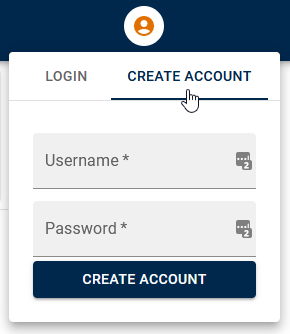
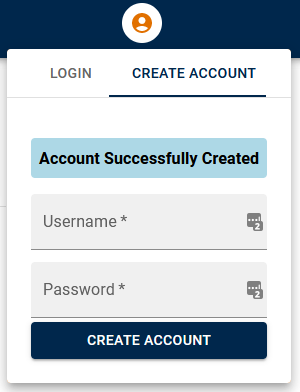
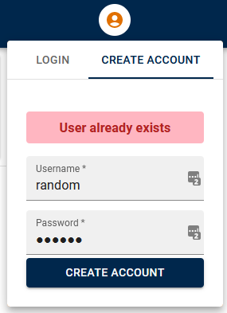
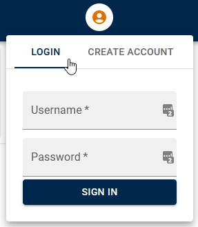
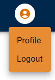
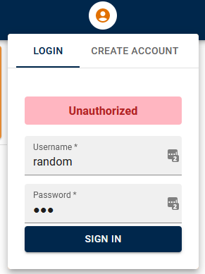

# Create user account

1. Click on the account menu icon

2. Click on the "CREATE ACCOUNT" tab

3. Create an acccount with any username and password of your choosing, by entering text into the two fields, and clicking the "Create Account" button.
4. On success you should get something that looks like the following:

5. If you try making another account with the same name you should get the following error:

# Login to Account

1. Click on the account menu icon

2. Click on the "LOGIN" tab

3. Enter the Username and Password from your account created in the previous step and click "SIGN IN"
4. On success you will see the following:

5. If the username or password is invalid you will see the following:

