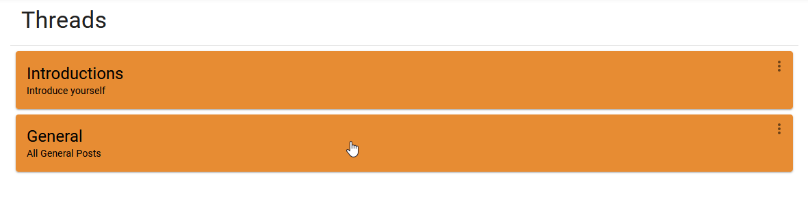
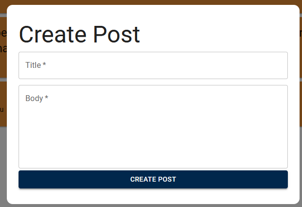
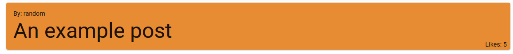
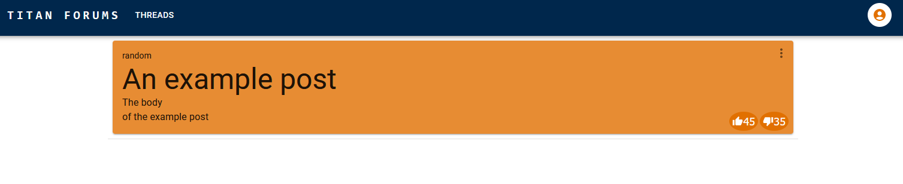
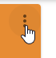
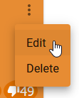
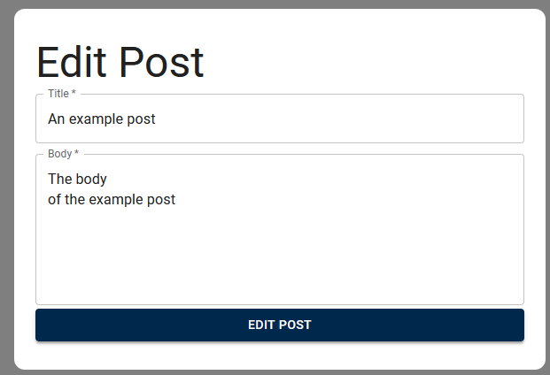
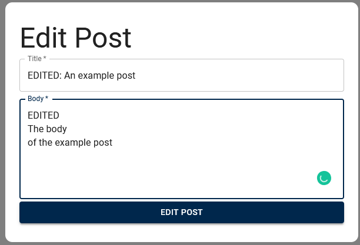
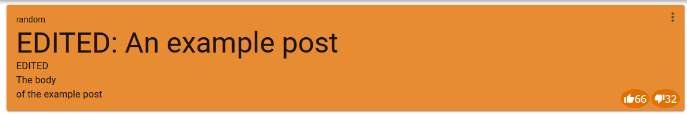

- [Create Post](#create-post)
- [Edit Post](#edit-post)
- [Delete Post](#delete-post)

# Create Post

1. Login/Create your account as shown in [login.md](login.md)
2. From the homepage click on a thread that you would like to post in
   1. In this example we will post in "General"
      
3. One on your selected thread, click the Plus Button on the bottom right of the screen
   
4. When clicked it will bring up the "Create Post" screen!
   
5. Enter the title and body you want for your post
   1. There is a limit or 128 character for the title and 1024 characters for the body. If exceeded they will give this error:
      
6. After creating the post it should appear towards to the bottom of the list like this:
   
7. Clicking on the post will bring you to its page
   

# Edit Post

A user can edit posts that they have created themeselves.
To get started make sure you are logged in and on the post's page.
We'll be using the post created in the [Create Post](#create-post) section

1. Click the 3 dot menu in the top left of the post

   

2. Click on the edit button

   

3. You should see something similar to the following:
   
4. From here you can enter your new title and body and submit the edits by clicking "EDIT POST"
   1. Similar to creating the post you will get errors if you exceed the character limit
      
5. After submiting you should should see your changes appear on the post page
   

# Delete Post
